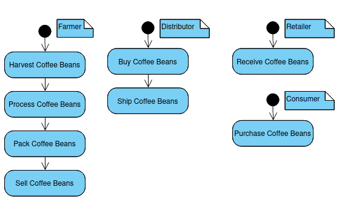
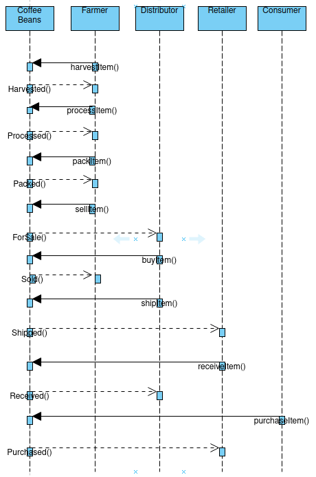
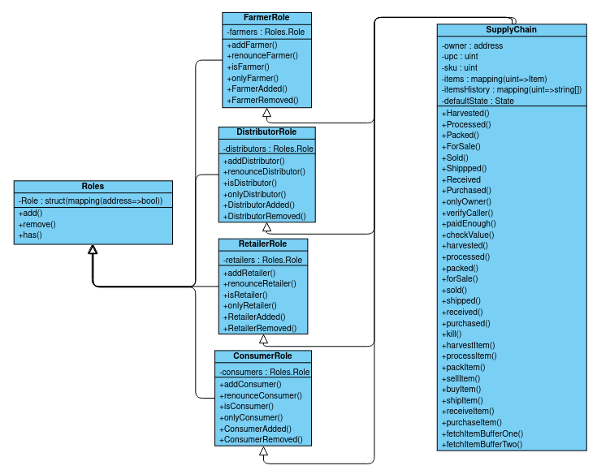
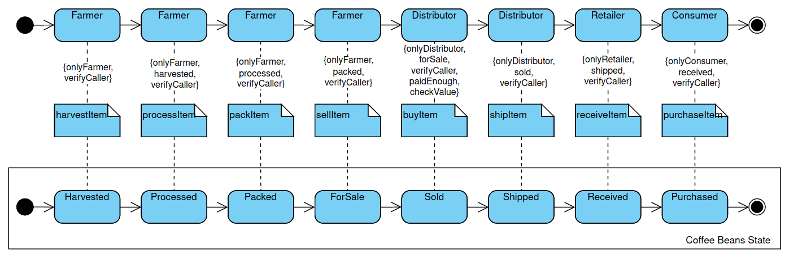

# Zanjir - Supply chain & data auditing
Zanjir (/zænd͡ʒi:r/) translates to chain in Persian and Urdu; represents the block chain powered supply chain solution in this repository.


This repository containts an Ethereum DApp that demonstrates a Supply Chain flow between a Seller and Buyer. The user story is similar to any commonly used supply chain process. A Seller can add items to the inventory system stored in the blockchain. A Buyer can purchase such items from the inventory system. Additionally a Seller can mark an item as Shipped, and similarly a Buyer can mark an item as Received.

The DApp User Interface when running should look like...


## Latest Deployment

The latest version of the Zanjir smart contract has been deployed on the Ropsten network at the following address:
```
0xe48d5FE18163B8efc234B5DB0b7A3bBea9075155
```

## Getting Started

These instructions will get you a copy of the project up and running on your local machine for development and testing purposes.

### Pre-requisites

Please make sure you've already installed ganache, Truffle and enabled MetaMask extension in your browser. This 
repository has been tested using the following versions: 

```
Truffle: v5.3.11 (core: 5.3.11)
Solidity: v0.5.16 (solc-js)
Node: v10.19.0
Web3.js: v1.3.6
```

### Libraries
Following is the list of libraries used in the builds and their purposes:
```
Web3.js to connect to the blockchain
Roles.js to provide a consistent role structure available to all actors
Truffle-assertions - to add a layer of assertions while testing the contract
Truffle-hdwallet-provider - to create an hd wallet to connect to the ropsten network through infura
truffle/contract - to use the latest TruffleContract constructor
```

### Diagrams

#### Activity Diagrams
The following are the expected actions of all actors.


#### Sequence Diagram
The following are the functions that will make the activity diagram actions possible.


#### Class Diagram
The Supply Chain contract inherits from various roles.


#### State Diagram
The actors (with the mentioned constraints enforced) interact with the blockchain to maintain the item/coffee bean state.



## Installation

A step by step series of examples that tell you have to get a development env running

Clone this repository:

```
git clone https://github.com/maqzi/Zanjir
```

Change directory to ```Zanjir``` folder and install all requisite npm packages (as listed in ```package.json```):

```
cd Zanjir
npm install
```

Launch Ganache:

```
ganache-cli -m "spirit supply whale amount human item harsh scare congress discover talent hamster"
```

Your terminal should look something like this:


In a separate terminal window, Compile smart contracts:

```
truffle compile
```

Your terminal should look something like this:


This will create the smart contract artifacts in folder ```build\contracts```.

Migrate smart contracts to the locally running blockchain, ganache-cli:

```
truffle migrate
```

Your terminal should look something like this:


Test smart contracts:

```
truffle test
```

All 10 tests should pass.


In a separate terminal window, launch the DApp:

```
npm run dev
```

## Built With

* [Ethereum](https://www.ethereum.org/) - Ethereum is a decentralized platform that runs smart contracts
* [IPFS](https://ipfs.io/) - IPFS is the Distributed Web | A peer-to-peer hypermedia protocol
  to make the web faster, safer, and more open.
* [Truffle Framework](http://truffleframework.com/) - Truffle is the most popular development framework for Ethereum with a mission to make your life a whole lot easier.

## Acknowledgments
* Udacity: Blockchain developer nano-degree
* Solidity
* Ganache-cli
* Truffle
* IPFS